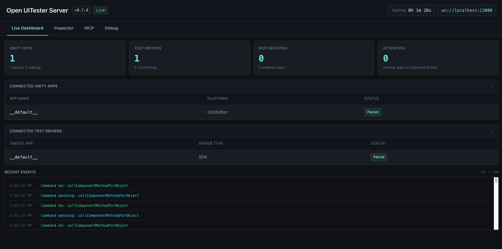
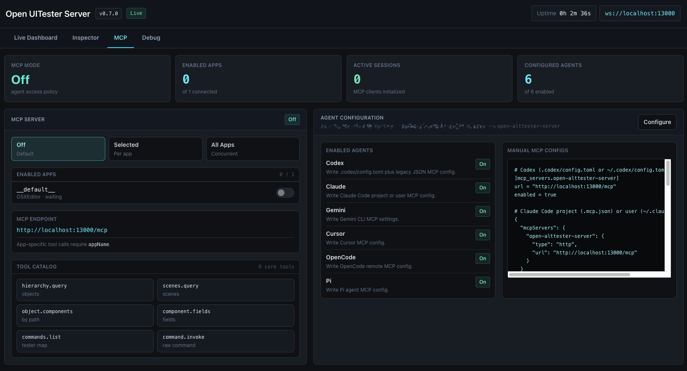

# Open UITester Server (`open-uitester-server`)

Free, open-source drop-in alternative to the commercial **AltTester® Desktop** app. WebSocket relay for the AltTester® Unity SDK, with a real-time web dashboard for Node.js and Bun.

Not affiliated with Altom® (Altom Ky). Official products: [alttester.com](https://alttester.com/).

[Project website](https://pmelch.github.io/open-uitester-server/) · [npm package](https://www.npmjs.com/package/open-uitester-server)

## Why this project exists

The [AltTester® Unity SDK](https://github.com/alttester/AltTester-Unity-SDK) is open source (GPL v3), but the **AltTester® Desktop** app — which acts as the relay between the SDK running in your Unity app and your test drivers — is a commercial, closed-source product.

This project is a free, open-source drop-in alternative to that Desktop app: a WebSocket server that speaks the same protocol, so you can run Unity SDK UI automation end to end without a commercial Desktop license. The Unity SDK and your existing Python/C#/Java/Robot test drivers connect to this server exactly the way they would connect to AltTester® Desktop.

If you need the extended features that ship with the commercial Desktop app — such as UI test recording and other productivity tooling — please consider purchasing an AltTester® Desktop license to support the upstream project.

## Requirements

- **Node.js** ≥ 20.6 — or — **[Bun](https://bun.sh)** ≥ 1.0

Both runtimes are fully supported. The server auto-detects the runtime at startup and selects the appropriate HTTP/WebSocket adapter.




---

## Quick start (from npm)

No clone required — run directly with **npm / npx**:

```bash
npx open-uitester-server
```

Or install globally:

```bash
npm install -g open-uitester-server
open-uitester-server
```

**Bun** users can use `bunx` / `bun install -g` as before:

```bash
bunx open-uitester-server
```

Custom port:

```bash
open-uitester-server --port 9000
# or
ALTSERVER_PORT=9000 open-uitester-server
```

Auto-enable the embedded MCP server (instead of using the dashboard MCP tab):

```bash
# All connected apps
open-uitester-server --mcp-all

# One or more named apps (repeat --mcp-app)
open-uitester-server --mcp-app MyUnityGame

# Or via environment (also works with npm start / bun run dev)
ALTSERVER_MCP_ALL=1 open-uitester-server
ALTSERVER_MCP_APP=MyUnityGame,OtherGame open-uitester-server
```

---

## From source

### Install

```bash
# Node.js
npm install

# Bun
bun install
```

### Start

```bash
# Node.js
npm start            # uses tsx

# Bun (faster startup)
npm run start:bun    # uses bun directly
# or
bun run start:bun
```

The server starts on port **13000** by default and prints:

```
UiTester Server running on port 13000
Dashboard: http://127.0.0.1:13000/
Unity apps connect to:  ws://127.0.0.1:13000/altws/app
Test drivers connect to: ws://127.0.0.1:13000/altws
Press Ctrl+C to stop.
```

Open `http://127.0.0.1:13000/` in a browser to see connected apps, drivers, and live events.

## Agent integrations

Open UITester Server supports two agent integration paths:

- **Embedded MCP server:** start the server and enable access with `--mcp-all` or `--mcp-app <name>` (or `ALTSERVER_MCP_ALL` / `ALTSERVER_MCP_APP`), or use the dashboard MCP tab. Point MCP clients at `http://127.0.0.1:13000/mcp`. The dashboard can write project or global config files for Codex, Claude, Gemini, Cursor, OpenCode, and Pi. See [docs/agents.md](./docs/agents.md) for setup details.
- **GitHub skill bundle:** use `skill/open-uitester-tools/` directly from GitHub when you want the same UiTester operations without MCP configuration. Codex can install it as a skill. Other agents can clone or vendor that folder, read `SKILL.md`, and call `scripts/uitester_tools.mjs` directly. The bundle talks to `GET /dashboard/state` and `ws://127.0.0.1:13000/altws`; it does not call or depend on the MCP server.



Install the bundle as a Codex skill:

```bash
python3 ~/.codex/skills/.system/skill-installer/scripts/install-skill-from-github.py \
  --repo PMelch/open-uitester-server \
  --path skill/open-uitester-tools \
  --ref main
```

Restart Codex after installing the skill. For other agents, clone or vendor `skill/open-uitester-tools/` from this repo and use its `SKILL.md` plus `scripts/uitester_tools.mjs`. See [docs/agents.md](./docs/agents.md) for manual MCP config examples, dashboard auto-setup targets, and skill details.

### Custom port

```bash
ALTSERVER_PORT=9000 npm start
```

### Development (auto-restart on file changes)

```bash
bun run dev
```

## Stop

Press **Ctrl+C** in the terminal. The server handles `SIGINT` and `SIGTERM` for clean shutdown.

## Unity SDK setup

| SDK field | Value |
|-----------|-------|
| Host | `127.0.0.1` (or the machine's IP for device testing) |
| Port | `13000` (or your custom `ALTSERVER_PORT`) |

The SDK connects to the `/altws/app` path automatically.

## Python driver setup

No changes needed if you already use the `AltDriver` class — it connects to port 13000 on localhost by default:

```python
from alttester import AltDriver

driver = AltDriver()          # defaults: host=127.0.0.1, port=13000
# or
driver = AltDriver(host="127.0.0.1", port=9000)  # custom port
```

## Testing the CLI locally (before publishing)

**Node.js** — use `npm link`:

```bash
npm install
npm link

# Now test as if installed from npm:
open-uitester-server
open-uitester-server --port 9000

npm unlink open-uitester-server
```

**Bun** — use `bun link`:

```bash
bun link

bunx open-uitester-server
bunx open-uitester-server --port 9000

bun unlink open-uitester-server
```

---

## Tests

```bash
# Node.js
npm test                  # vitest (recommended for CI)

# Bun
npm run test:bun          # bun test
npm run test:bun:watch    # re-run on file changes
npm run test:bun:coverage # with coverage report
```

## Environment variables

| Variable | Default | Description |
|----------|---------|-------------|
| `ALTSERVER_PORT` | `13000` | Port for both the WebSocket server and HTTP dashboard |
| `ALTSERVER_MCP_ALL` | _(unset)_ | Set to `1` / `true` to enable MCP for all apps at startup |
| `ALTSERVER_MCP_APP` | _(unset)_ | Comma-separated app names for MCP access at startup |

## Changelog

See [CHANGELOG.md](./CHANGELOG.md) for release notes.
