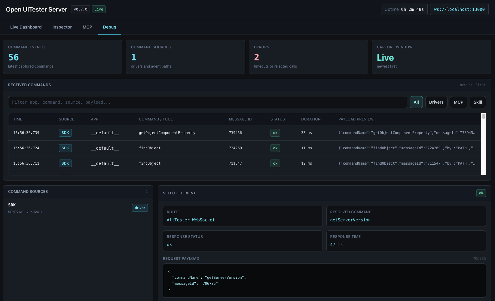

# Agent Integrations

Open UITester Server ships three related artifacts:

- The npm package and CLI: `open-uitester-server`
- The embedded MCP server: `http://127.0.0.1:13000/mcp`
- The independent GitHub skill/helper bundle: `skill/open-uitester-tools/`

The MCP server and the GitHub skill bundle are peers. Use MCP when your agent supports MCP clients directly. Use the bundle when you want a dynamically loaded or repo-local implementation that talks to `/dashboard/state` and `/altws` without depending on MCP.

## Enable MCP Access

Start the server:

```bash
npx open-uitester-server
```

Enable MCP from the CLI instead of the dashboard:

```bash
npx open-uitester-server --mcp-all
npx open-uitester-server --mcp-app MyUnityGame
```

Open the dashboard at `http://127.0.0.1:13000/`, then use the MCP panel to enable access for all connected apps or selected apps (unless you already enabled MCP via CLI). The MCP endpoint is:

```text
http://127.0.0.1:13000/mcp
```

The dashboard agent configuration panel can write MCP client config files for Codex, Claude, Gemini, Cursor, OpenCode, and Pi. Choose project scope for repo-local config or global scope for user-wide config, then save.


## Auto Setup Targets

| Agent | Project config | Global config |
| --- | --- | --- |
| Codex | `.codex/config.toml` plus `.codex/mcp.json` legacy compatibility | `~/.codex/config.toml` plus `~/.codex/mcp.json` |
| Claude Code | `.mcp.json` | `~/.claude.json` |
| Gemini CLI | `.gemini/settings.json` | `~/.gemini/settings.json` |
| Cursor | `.cursor/mcp.json` | `~/.cursor/mcp.json` |
| OpenCode | `opencode.json` | `~/.config/opencode/opencode.json` |
| Pi | `.pi/mcp.json` | `~/.pi/agent/mcp.json` |

## Manual MCP Config

### Codex

Codex uses TOML config:

```toml
[mcp_servers.open-uitester-server]
url = "http://127.0.0.1:13000/mcp"
enabled = true
```

Use `.codex/config.toml` for project config or `~/.codex/config.toml` for global config. The dashboard also writes `.codex/mcp.json` for legacy compatibility with older local setups.

### Claude Code

Claude Code project scope uses `.mcp.json` in the project root:

```json
{
  "mcpServers": {
    "open-uitester-server": {
      "type": "http",
      "url": "http://127.0.0.1:13000/mcp"
    }
  }
}
```

Equivalent CLI setup:

```bash
claude mcp add --transport http open-uitester-server --scope project http://127.0.0.1:13000/mcp
```

Use `--scope user` for a user-wide config.

### Gemini CLI

Gemini CLI reads MCP servers from `settings.json`:

```json
{
  "mcpServers": {
    "open-uitester-server": {
      "httpUrl": "http://127.0.0.1:13000/mcp"
    }
  }
}
```

Use `.gemini/settings.json` for project config or `~/.gemini/settings.json` for global config.

### Cursor

Cursor reads `mcp.json` from the project or global Cursor config directory:

```json
{
  "mcpServers": {
    "open-uitester-server": {
      "url": "http://127.0.0.1:13000/mcp"
    }
  }
}
```

Use `.cursor/mcp.json` for project config or `~/.cursor/mcp.json` for global config.

### OpenCode

OpenCode stores MCP servers in `opencode.json`:

```json
{
  "mcp": {
    "open-uitester-server": {
      "type": "remote",
      "url": "http://127.0.0.1:13000/mcp",
      "enabled": true
    }
  }
}
```

Use `opencode.json` for project config or `~/.config/opencode/opencode.json` for global config.

### Pi

Pi needs an MCP extension such as `pi-mcp-extension` installed first:

```bash
pi install npm:pi-mcp-extension
```

Then configure the Open UITester MCP endpoint:

```json
{
  "mcpServers": {
    "open-uitester-server": {
      "transport": "streamable-http",
      "url": "http://127.0.0.1:13000/mcp"
    }
  }
}
```

Use `.pi/mcp.json` for project config or `~/.pi/agent/mcp.json` for global config.

## Skill Bundle Alternative

The reusable bundle lives at `skill/open-uitester-tools/`. It intentionally does not call the MCP endpoint or read MCP config. It exposes the same operations through its helper script and talks directly to:

- `GET /dashboard/state`
- `ws://127.0.0.1:13000/altws`

Codex can install it from GitHub with the Codex skill installer:

```bash
python3 ~/.codex/skills/.system/skill-installer/scripts/install-skill-from-github.py \
  --repo PMelch/open-uitester-server \
  --path skill/open-uitester-tools \
  --ref main
```

Use `--ref <tag-or-branch>` to pin a release or branch. Restart Codex after installing so the skill metadata is loaded.

Other agents can clone or vendor the same GitHub folder, read `SKILL.md` as the local instruction entry point, and invoke the helper script directly:

```bash
node skill/open-uitester-tools/scripts/uitester_tools.mjs tools
node skill/open-uitester-tools/scripts/uitester_tools.mjs state
node skill/open-uitester-tools/scripts/uitester_tools.mjs call scenes.query '{"appName":"__default__"}'
```

The debug dashboard can distinguish commands from normal drivers, MCP clients, and the independent helper bundle while you are comparing behavior.



Keep the skill implementation in sync whenever MCP tools, command allowlists, JSON-RPC behavior, or dashboard agent setup changes.
